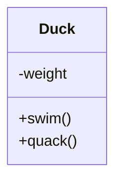
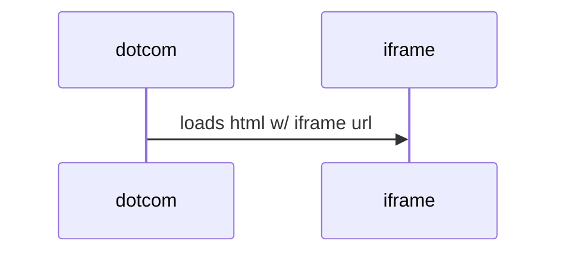

# Markdown教程


## 您好，欢迎来到我的markdown教程。👋

在本教程中，您将学习有关Markdown的最基础的内容。👩‍🏫👨‍🏫

- [此处](https://github.com/LewisVo/Markdown-Tutorial/blob/master/Translation:Spanish.md) 提供西班牙文版 🇪🇸。
- [此处](https://github.com/LewisVo/Markdown-Tutorial/blob/master/README_pt-BR.md) 提供葡萄牙语版本 🇵🇹。
- [此处](https://github.com/luongvo209/Markdown-Tutorial/blob/master/README_fr.md) 提供法文版 🇫🇷。

*******

目录

1. [Markdown是什么？](#whatismarkdown)
2. [为什么使用Markdown ？](#why)
3. [Markdown工具](#tools)
4. [Markdown 语法](#syntax)

*******

<div id='whatismarkdown'/>

## Markdown是什么？

根据维基百科：

> *Markdown是一种轻量级的标记语言，具有纯文本格式语法，因此可以使用工具将其转换为名称相同的HTML和许多其他格式。Markdown通常用于格式化readme文件、在线讨论论坛中撰写消息以及使用纯文本编辑器创建丰富的文本。*

`简单地说：它只是另一种类型的文本文件，如.txt .doc...... （只是以.md结尾: laughing: ） ，并且它有一些特殊的语法。`

<div id='why'/>

*并没有明确界定的Markdown标准。这导致了碎片化，因为不同的供应商编写自己的语言变体以更正缺陷或添加缺失的功能。此处列出了一些markdown风格(https://github.com/jgm/CommonMark/wiki/Markdown-Flavors)。*

本指南将主要关注Github风格Markdown。

## 为什么使用markdown ？

因为它是：

* **简单** ：语法非常简单，您可以在一两分钟内学习，然后顺畅写作，不会觉得怪异或难搞。
* **快速** ：与其他类型的文本文件/格式相比，它节省时间。它有助于提高写作者的生产力和工作流程。
* **干净** ：语法和输出都干净，不会弄花我们的眼睛，管理简单。
* **灵活** 性 ：只需稍作设置，您的文本可以翻译到任意平台使用，可在任何文本编辑软件中编辑，并可转换成各种格式。 
* **简而言之** ，普通用户会发现它在任何情况下都很有用，尤其是当您需要比纯文本更好用但功能比Microsoft Word更简单的文本处理工具时。  **对于开发人员** ，如果您懒于编写HTML代码，您会喜欢markdown。**此外** ，**Github** 和许多网站都倾向于对项目的readme文件选择markdown。这意味着,你在生活中，会以某种方式遇到markdown。

<div id='tools'/>

## Markdown工具

如上所述，任何编辑器都可以用于编辑markdown。但是，在编辑markdown时，有一些工具可能对您非常有用。

* **[*Stackedit*](https://stackedit.io)** ：好的，现在你可以停止阅读了。点击链接，然后以最疯狂的方式开始您的markdown之旅。只需键入普通文本，然后使用鼠标，点击完成。你不必知晓语法。这是很好的，但它会使你依赖，大多数开发人员更喜欢键盘。
* **[*Dillinger*](http://dillinger.io/)** ：在线工具，支持实时视图（拆分屏幕）和支持导出为html格式。没什么特别的，但非常整洁方便。
* **[*Typora*](https://www.typora.io/)** ：适用于Mac和Windows, 极简，无干扰，无缝显示实时视图，还带有了许多其他内容，如图像，列表，表格，代码栏，数学块，YAML ，前沿事项，Toc ，...
* **[*Atom*](https://atom.io/)** ：流行的黑客用的文本编辑器（此刻您可能正在用它）。它是多功能。支持Markdown？Markdown虽然只是它的一部分，但是其markdown内置非常好。
* **[*Minimalist Markdown*](https://chrome.google.com/webstore/detail/minimalist-markdown-edito/pghodfjepegmciihfhdipmimghiakcjf?hl=en)** ： Chrome应用程序。如果你安装了Chrome浏览器（这是我最喜欢的） ，Chrome应用程序则无处不在。
* **[*Macdown*](http://macdown.uranusjr.com/)** ：最适合Mac。
* **[*MarkdownPad*](http://markdownpad.com/)** ：最适合Windows。
* **[*Remarkable*](https://remarkableapp.github.io/)** ：最适合Linux。
* **[*GITBOOK*](http://www.gitbook.com/)** ： GitBook是一款现代化的发布工具链。使写作和协作都容易。它既支持Markdown ，又与喜爱的Github有着密切的关系。

<div id='syntax'/>

## Markdown 语法

您可以在 [此 处](https://daringfireball.net/projects/markdown/syntax) 找到所有语法。在文本中描述语法（它们将被格式化）将需要花费大量努力，因此请考虑下面表格中的整个基础语法。

| 格式            | 语法                                                    | 示例                                                                  |
| ------------- | ----------------------------------------------------- | ------------------------------------------------------------------- |
| 斜体            | \*文本\*                                                | *这是斜体*                                                              |
| 粗体            | \*\*粗体\*\*                                            | **这是粗体**                                                            |
| 内联链接          | \ [描述文本\] (此处写url链接 )                                 | A [链接](http://www.github.com)                                       |
| 图片            | \![标题\] (图片链接)                                        | 一张图片 图                          |
| 链接+图片         | \[\![标题\] (图片链接)\] (页面链接)\]                           | 点击我 [](https://www.youtube.com) |
| 脚注            | 我还有很多\ [^ 1\]要说。\ [^ 1\]:在这里说。                        | <a href="#section1">嘿，请阅读这张表下面的备注。                                  |
| 换行符           | 双空格+回车                                                |                                                                     |
| 无序列表          | \ *项目1\ *项目2                                          | <ul><li>项目1</li><li>项目2</li><li>项目3</li><li>项目4</li></ul>           |
| 有序列表          | 1. 项目 a    2. 项目 b                                    | <ol><li>项目a</li><li>项目b</li><li>项目c</li><li>项目d</li></ol>           |
| 混合列表          | 1.项目1 *项目1a                                           | <ol><li>项目a</li></ol><ul><li>项目1</li></ul>                          |
| 块引用           | \ >引用文本                                               | <blockquote>求知若饥，虚心若愚</blockquote>                                  |
| 预格式化          | 每行以两个或更多空格开头，使文本看起来像，e x a c t l y,like,you,type i,t. | 每行以两个或更多空格开头，使文本看起来像，e x a c t l y,like,you,type i,t.               |
| 代码            | \`插入代码\`                                              | `cout < < "Hello world";`                                           |
| 代码块/ 语法高亮     | \`\`\`插入代码\`\`\`                                      | <a href="#section1">嘿，请阅读这张表下面的备注。                                  |
| 页眉            | , \##, \###, \####, \#####, \###### (从 h1 到 h6)       | <h3>这是h3页眉</h3>                                                     |
| 删除线           | \ ~在此处~ 插入文本\ ~~                                      | ~~我死了~~                                                             |
| 表             | \                                                     | 表格\                                                                 |
| 脚注            | 脚注[\ ^ 1\] <br> [\ ^ 1\]:文本引用                         | 下面是一个简单的脚注[ ^ 1] 。其后有一些额外的文本。                                       |
| [^ 1]:我的脚注引用。 |                                                       |                                                                     |

<br></br>
<br></br>

<p id="section1">注意： * *脚注* *实际上在表中没有正确渲染，但它看起来像这样 </p>

  <br></br>
**块代码/语法高亮也是如此** 。它看起来像这张照片：

.

这些特性取决于每个markdown风格。

## 实用说明：

* Markdown允许您使用反斜杠转义来生成文字字符，否则将在Markdown的格式语法中具有特殊含义。一个常用的反斜杠转义字符是:\     
   `So?\ *这\ *不再是斜体，而是被文字星号包围。`

* Youtube视频需要一些额外的工作。
  
  ```
  They can't be added directly but you can add an image with a link to the video like this:
  <a href="http://www.youtube.com/watch?feature=player_embedded&v=YOUTUBE_VIDEO_ID_HERE
  " target="_blank"></a>
  ```

* Markdown支持Emojii: laughing:: laughing:: kissing_heart:: innocent:: green_heart: ([在这里](http://www.emoji-cheat-sheet.com/) 获取一些表情符号)

* 您可以使用\<br/> tag强制换行。

* 如果在创建新行时遇到问题，则输入双空格。

* 光看不如练习。您可以创建一个markdown文件供自己练习，也可以在 [此](http://www.markdowntutorial.com) 处在线练习。

* 脚注和语法高亮不属于原始markdown，仅支持某些markdown风格（来自 [Sean Brody](https://goo.gl/ASZwEn) 的反馈）

* 任何URL （如http://www.github.com/ ）都将自动转换为可点击的链接。

* Markdown对表格的支持旨在为大多数人处理大部分表格；它并不涵盖所有类型表格。如果您需要复杂的表格，则需要手动或使用专为输出格式设计的工具来创建它们。

* 使用图片和链接时，可以在渲染时创建一些色彩资源。像这样的徽章是典型的例子，您可以在Github  [](https://github.com/)  [](https://github.com/)
   [](https://github.com/)
   [](https://github.com/)
   [](https://www.linkedin.com/)
   [ （在此处获取一些徽章）](https://github.com/)
    [](https://shields.io/)

* 使用带有不同语言的代码块语法生成彩色文本。仍然有一些限制，例如无法在文本中设置样式，颜色很少。当您想突出显示一些注释或显示两个代码块之间的差异时，这可以适用

```diff
- text in red
+ text in green
! text in orange
# text in gray
@@ text in purple (and bold)@@
```

* 在Github上的markdown文件中，通过指定代码块语法和Mermaid语言，我们可以绘制多种图表。更多语法和示例图 [在这里](https://mermaid-js.github.io/)
  
  - 类图



- 时序图



- 流程图


###### 作者： *Vo Tran Thanh Luong* 。此外，我还要感谢所有撰稿人/翻译人员所做的工作。
